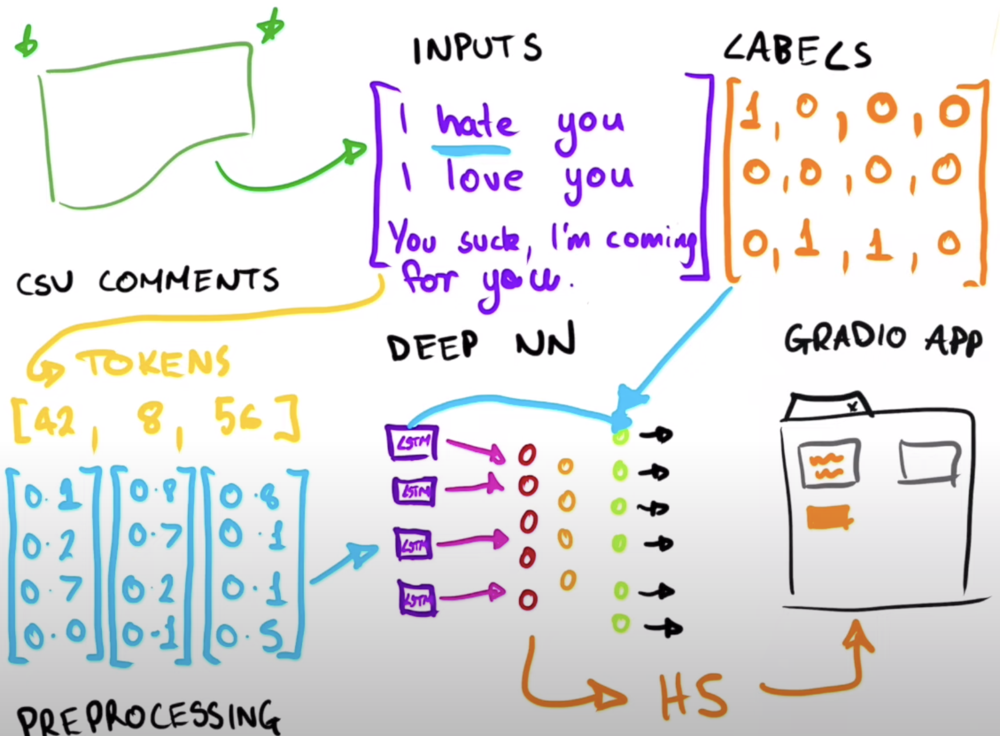

# Comment Toxicity Detector Model
----------

## Project description
This Comment Toxicity Detector is a machine learning model that is trained to classify text comments as toxic or non-toxic. This classification is based on several parameters/labells: **toxic**, **severe_toxic**, **obscene**, **threat**, **insult**, **identity_hate**. The model has been trained on a dataset of labeled comments. The model can then be used to classify new comments.

## Gameplan
1. Loading in Data
2. Preprocessing Comment
3. Creating a Deep NLP Model
4. Evaluating Model Performance
5. Creating a Gradio DL App

### Overview

## You'll need
- Python 3.8
- Azure Cognitive Services
- Notion API
- Streamlit

## How to use
1. Clone the repository
2. Create a Notion Database and get the database ID
3. Create a Notion API key and get the API key
4. Create an Azure Cognitive Services resource and get the API key
5. Create a .env file and add the following variables
    - NOTION_DATABASE_ID
    - NOTION_API_KEY
    - AZURE_SPEECH_KEY
    - AZURE_SPEECH_REGION
6. Run the application

## You'll need
- Python 3.9
- Dependancies that are specified on the .yml file
- Dataset [Malignant VS Benign](https://www.kaggle.com/datasets/fanconic/skin-cancer-malignant-vs-benign)

## How to use
1. Clone the repository
2. Download the image dataset from the Kaggle link
3. Create a folder called data and upload the data from Kaggle
3. Run the Malignant_Benign_DNN.ipynb file
4. Open the link from the gradio user interface

